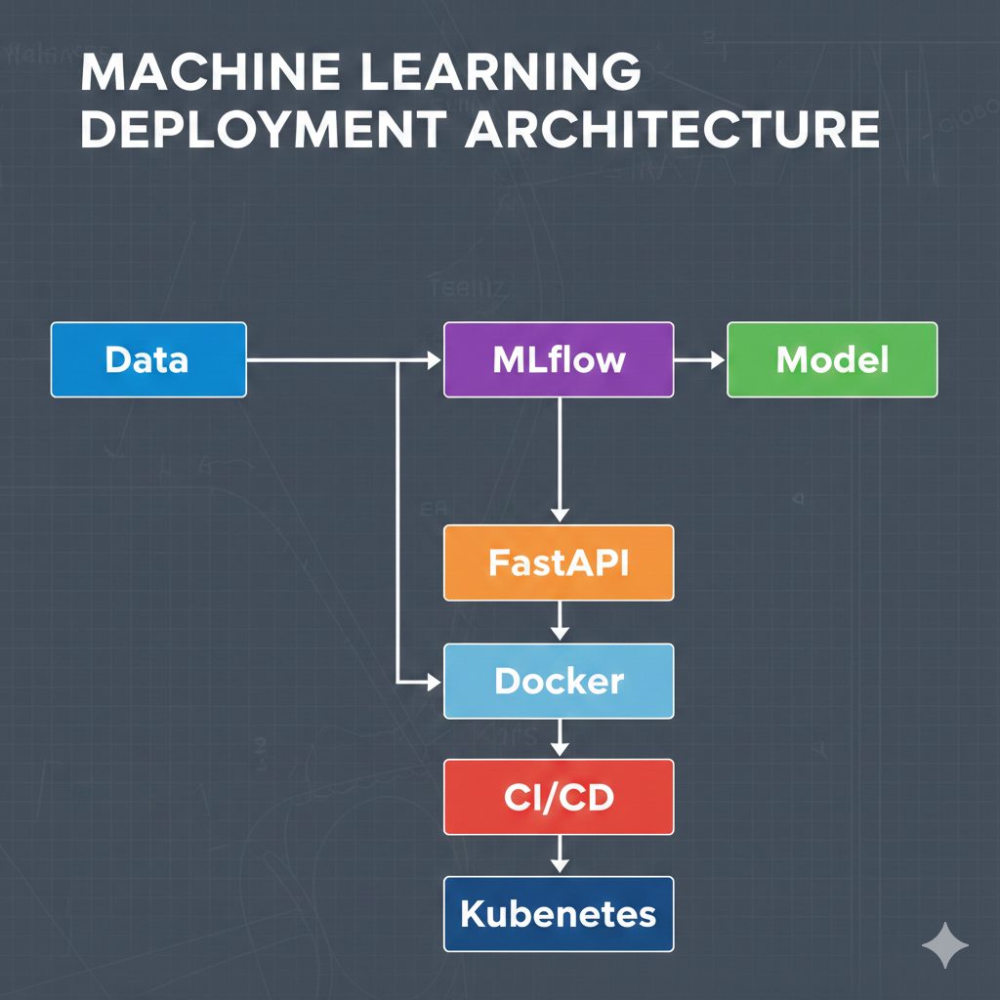

# End-to-End MLOps Pipeline

## Overview

This project implements a comprehensive, production-ready Machine Learning Operations (MLOps) pipeline that demonstrates best practices for deploying machine learning models from development to production. The pipeline covers the entire ML lifecycle including data ingestion, model training, experiment tracking, model serving, continuous integration/continuous deployment (CI/CD), and infrastructure as code.

The project focuses on predicting customer churn probability for subscription-based services, using historical customer data to identify at-risk customers and enable proactive retention strategies.

## Problem Statement

Customer churn prediction is a critical business problem for subscription-based companies. High churn rates can significantly impact revenue and growth. This project addresses the challenge by:

- Building an accurate predictive model to identify customers likely to churn
- Implementing an automated pipeline for model training and deployment
- Ensuring scalability and reliability in production environments
- Providing monitoring and maintenance capabilities for ongoing model performance

### Business Impact
- Early identification of at-risk customers
- Targeted retention campaigns
- Reduced customer acquisition costs
- Improved customer lifetime value

## Architecture


## Tech Stack

### Core Technologies
- **Python 3.9+**: Primary programming language
- **Scikit-learn**: Machine learning algorithms and preprocessing
- **MLflow**: Experiment tracking, model management, and deployment
- **FastAPI**: High-performance web framework for inference API
- **Docker**: Containerization for consistent environments
- **Kubernetes**: Container orchestration and scaling
- **Terraform**: Infrastructure as code for cloud resources

### DevOps & CI/CD
- **GitHub Actions**: Automated testing, building, and deployment
- **Pre-commit Hooks**: Code quality and formatting checks
- **Pytest**: Unit and integration testing
- **Black & Flake8**: Code formatting and linting

### Cloud & Infrastructure
- **Azure/AWS/GCP**: Cloud platform (configurable)
- **Azure Kubernetes Service / EKS / GKE**: Managed Kubernetes
- **Azure Container Registry / ECR / GCR**: Container registry
- **Azure Monitor / CloudWatch / Cloud Monitoring**: Observability

## Data Pipeline

### Input Features
The model uses the following customer features for churn prediction:
- **Tenure**: Number of months the customer has been with the service
- **Monthly Charges**: Monthly billing amount
- **Contract Type**: Month-to-month, one-year, or two-year contracts
- **Payment Method**: Electronic check, mailed check, bank transfer, credit card

### Data Processing
- Automated data validation and cleaning
- Feature engineering and transformation
- Train/validation/test splits with stratification
- Handling of missing values and outliers

## Model Development

### Baseline Models
- **Logistic Regression**: Interpretable baseline model
- **Random Forest**: Ensemble method for improved accuracy
- **Gradient Boosting**: Advanced ensemble techniques (optional)

### Model Evaluation
- **Metrics**: AUC-ROC, Precision, Recall, F1-Score
- **Business Metrics**: Lift analysis, cost-benefit optimization
- **Cross-validation**: Robust performance estimation

### Hyperparameter Tuning
- Grid search and random search optimization
- Automated tuning pipelines
- Performance vs. complexity trade-offs

## CI/CD Workflow

The CI/CD pipeline automates the entire ML lifecycle:

### Continuous Integration
- Automated testing on code changes
- Data validation checks
- Model performance regression tests
- Code quality and security scans

### Continuous Deployment
- Automated model retraining on new data
- Container image building and scanning
- Staging environment deployment
- Production rollout with canary deployments

### GitHub Actions Workflows
- `ci.yml`: Code quality, testing, and building
- `cd.yml`: Deployment to staging and production
- `data-validation.yml`: Data quality checks
- `model-retraining.yml`: Scheduled model updates

## Infrastructure Design

### Terraform Modules
- **Network Module**: VPC, subnets, security groups
- **Compute Module**: Kubernetes cluster configuration
- **Storage Module**: Data lakes, model artifacts storage
- **Monitoring Module**: Logging and metrics collection

### Environment Configurations
- **Development**: Single-node Kubernetes for testing
- **Staging**: Multi-node cluster for integration testing
- **Production**: Highly available, multi-zone deployment

### Security Considerations
- Network isolation and access controls
- Secret management with Azure Key Vault
- Container image scanning and vulnerability assessment
- RBAC for Kubernetes resources

## Kubernetes Deployment

This project includes Kubernetes manifests for deploying the FastAPI ML inference service.

Components:
- Deployment with multiple replicas for scalability
- Internal Kubernetes Service for API access
- Environment-based model configuration

These manifests are designed for cloud-managed Kubernetes platforms such as EKS, GKE, or AKS.

## Terraform Infrastructure Design

This project includes Terraform code to provision cloud infrastructure for deploying the ML inference system.

Infrastructure includes:
- AWS VPC with public and private subnets
- Managed EKS cluster for Kubernetes workloads
- Autoscaling node groups for ML services

The infrastructure is designed following best practices for production-grade MLOps systems.


## Scalability & Monitoring

### Horizontal Scaling
- Kubernetes Horizontal Pod Autoscaler (HPA)
- Custom metrics-based scaling (CPU, memory, request rate)
- Auto-scaling groups for underlying infrastructure

### Monitoring Stack
- **Application Metrics**: Response times, error rates, throughput
- **Model Metrics**: Prediction accuracy, data drift detection
- **Infrastructure Metrics**: Resource utilization, health checks
- **Business Metrics**: Churn prediction impact, retention rates

### Alerting
- Performance degradation alerts
- Model accuracy drift notifications
- Infrastructure health monitoring
- Automated incident response workflows

## Model Serving

### Inference API
- RESTful endpoints for real-time predictions
- Batch prediction capabilities
- Input validation and error handling
- Request/response logging

### Model Versioning
- Semantic versioning for model releases
- A/B testing capabilities
- Gradual rollout with traffic splitting
- Rollback mechanisms for failed deployments

## Trade-offs & Design Decisions

### Technology Choices
- **Scikit-learn vs. Deep Learning**: Chose traditional ML for interpretability and faster iteration
- **FastAPI vs. Flask**: Selected FastAPI for automatic API documentation and better performance
- **Kubernetes vs. Serverless**: Chose Kubernetes for consistent deployment across environments

### Architecture Decisions
- **Microservices**: Enables independent scaling and deployment of components
- **Containerization**: Ensures environment consistency from development to production
- **Infrastructure as Code**: Provides version-controlled, reproducible infrastructure

### Limitations
- Single model type (tabular data focused)
- Cloud provider specific (though modular design allows adaptation)
- Assumes structured data inputs

## Getting Started

### Prerequisites
- Python 3.9+
- Docker
- kubectl
- Terraform
- Azure CLI (for Azure deployment)

### Local Development
```bash
# Clone the repository
git clone <repository-url>
cd mlops-end-to-end-pipeline

# Install dependencies
pip install -r requirements.txt

# Run data ingestion
python -m src.ingestion.ingest_data

# Train model
python -m src.training.train_model

# Start inference API
uvicorn src.inference.api:app --reload
```

### Deployment
```bash
# Initialize Terraform
cd infra/terraform
terraform init

# Plan deployment
terraform plan -var-file=dev/terraform.tfvars

# Apply changes
terraform apply -var-file=dev/terraform.tfvars
```

## Future Improvements

### Short-term
- Implement automated model retraining pipelines
- Add model explainability features (SHAP, LIME)
- Enhance monitoring with custom dashboards
- Implement multi-model ensemble predictions

### Long-term
- Support for unstructured data (images, text)
- Edge deployment capabilities
- Federated learning for privacy-preserving training
- Integration with feature stores (Feast, Tecton)

### Research Areas
- Deep learning models for improved accuracy
- Online learning for real-time model updates
- Causal inference for better retention strategies
- Multi-armed bandit approaches for intervention optimization

## Contributing

Please read [CONTRIBUTING.md](CONTRIBUTING.md) for details on our code of conduct and the process for submitting pull requests.

## License

This project is licensed under the MIT License - see the [LICENSE](LICENSE) file for details.

## Acknowledgments

- Inspired by industry best practices from Google, Netflix, and Uber
- Built using open-source tools and frameworks
- Thanks to the MLflow and Kubernetes communities
